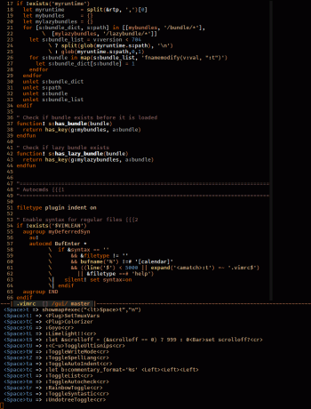

Vim-showmap
============
Showmap helps you type multi-char mappings.

For instance, in Tpope's _unimpaired_ plugin, you can toggle some Vim options 
with the `co` maps Eg. `col` toggles the 'list' option. Say you quickly want
to toggle 'cursorcolumn': you start typing `co`, and then... damn, what's the
letter again for 'cursorcolumn'? 'c'? Nah, that's 'cursorline'. Shoot, the
mapping timed out...

Showmap automatically binds a helper mapping on common prefixes, like `co`,
and when you stall at that point, a list of available keys is shown; the
helper can wait as long as you want for you to complete it, or you can get
more details about individual mappings.

Screenshots
------------
Stalling on `<Leader>t`, my prefix for setting/toggling some mode/options:

(Taken on minTTY with Office Code Pro font and [Fahrenheit color theme](https://github.com/fcpg/vim-fahrenheit))

Installation
-------------
Use your favorite method:
*  [Pathogen][1] - git clone https://github.com/fcpg/vim-showmap ~/.vim/bundle/vim-showmap
*  [NeoBundle][2] - NeoBundle 'fcpg/vim-showmap'
*  [Vundle][3] - Plugin 'fcpg/vim-showmap'
*  manual - copy all of the files into your ~/.vim directory

Help
-----
Run :helptags (or :Helptags with Pathogen), then :help showmap

License
--------
[Attribution-ShareAlike 4.0 Int.](https://creativecommons.org/licenses/by-sa/4.0/)

[1]: https://github.com/tpope/vim-pathogen
[2]: https://github.com/Shougo/neobundle.vim
[3]: https://github.com/gmarik/vundle
